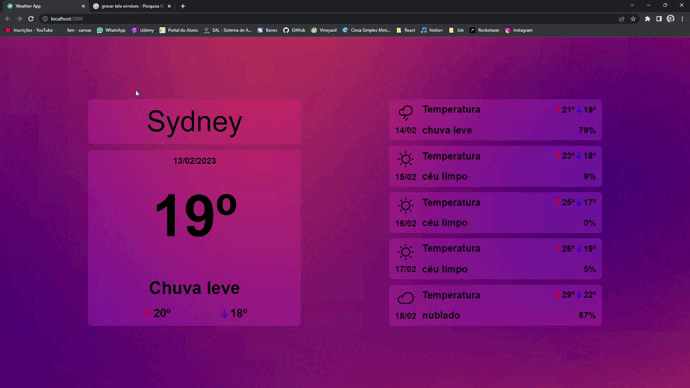
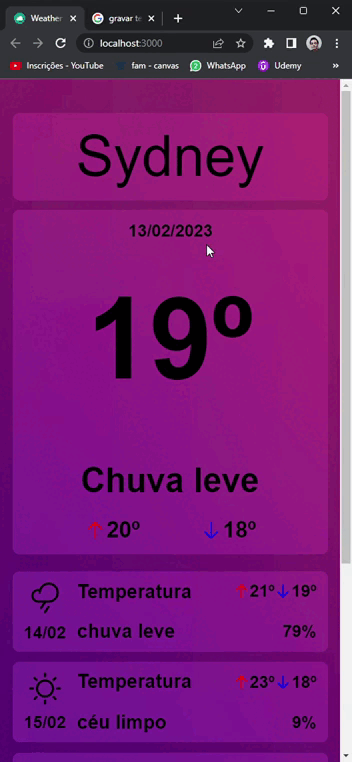

<h1>Weather App</h1>
👨‍💻 Site que mostra a temperatura atual, previsão de tempo e mais informações meteriológicas de várias cidades do mundo. 
🪄 Pesquisa realizada com ou sem letras maiúsculas. 
🔢 Aplicação desenvolvida com a API da Open Weather, disponivel em https://openweathermap.org/api 
🤏🏽 Site totalmente responsivo.

<h2>Tecnologias Utilizadas</h2>
    <h3>Front End</h3>
    - React JS  
    - Typescript  
    - Tailwind CSS 
    
<h2>Versão Desktop</h2>  

<h2>Versão Mobile</h2>  

